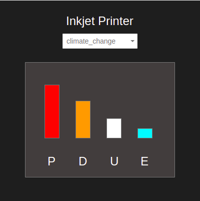

# Stimulus Chartjs

[](https://www.npmjs.com/package/stimulus-chartjs)
[](https://www.npmjs.com/package/stimulus-chartjs)
[](https://github.com/stimulus-components/stimulus-chartjs)
[](https://github.com/stimulus-components/stimulus-chartjs)
[](https://app.netlify.com/sites/stimulus-chartjs/deploys)

## Getting started

A Stimulus controller to deal with chart.js.

## 📚 Documentation

See [stimulus-chartjs documentation](https://stimulus-components.netlify.app/docs/components/stimulus-chartjs/).

## 👷‍♂️ Contributing

Do not hesitate to contribute to the project by adapting or adding features ! Bug reports or pull requests are welcome.

## 📝 License

This project is released under the [MIT](http://opensource.org/licenses/MIT) license.


-------------------------------------------------------------------------------------------------------------------------------------


# Coding challenge 

## Impact graphs



- Clone this project 
- Write a HTML page that follows the mockup above and uses the following JSON data:

```javascript
{
  name: "Inkjet Printer",
  impacts: {
    climate_change: {
      production: 45,
      distribution: 23,
      use: 12,
      end_of_life: 5
    },
    energy_use: {
      production: 32,
      distribution: 5,
      use: 28,
      end_of_life: 1
    }
  }
}
```

- By default it should generate a SVG graph based on the data from the first impact (eg. climate_change). 
- Try to get the bar graph as close as possible to the mockup.
- The select element should be filled with all available impacts (eg. climate_change and energy_use).
- The graph will be redraw when the user selects a different option.
- You may use any framework but we are giving bonus points for Tailwind CSS, Stimulus JS and HTML5 SVG.
- You may ask any question regarding the challenge. Good communication is paramount.
- Send us the link to your project, we will use it during an online interview. 

Happy coding!

Earthster Team